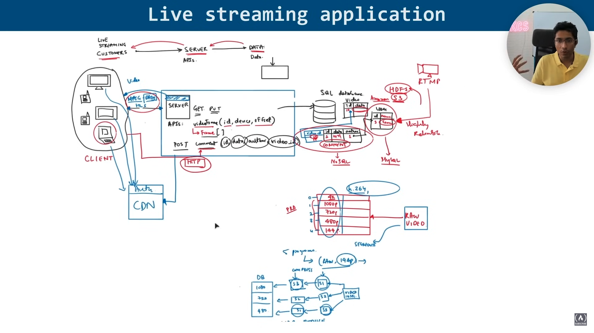
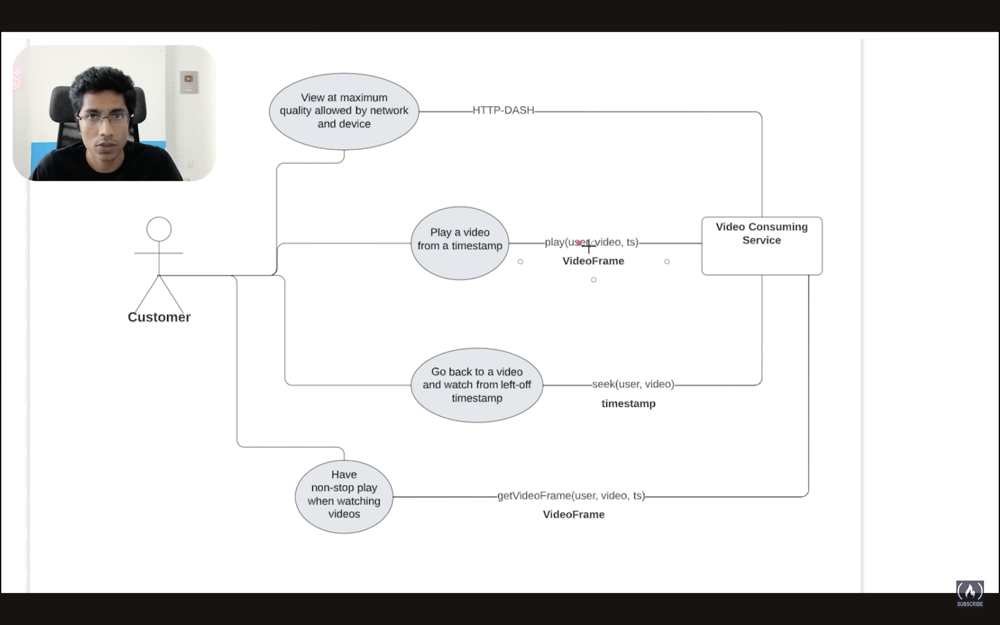
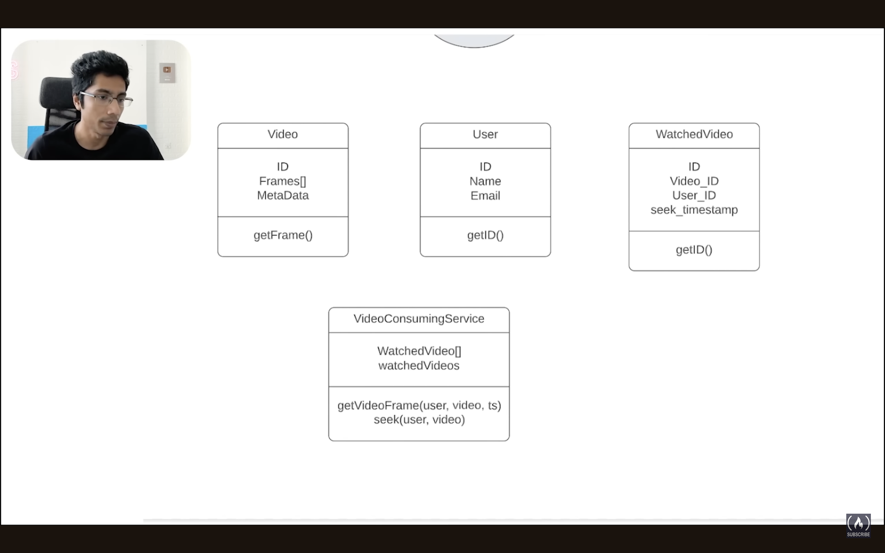

# System Design: Live Streaming Application

## Client Side:
- Devices: Mobile, Laptop, Tablet, Desktop
- Streaming Protocols: MPEG-DASH, HLS

## Server Side:
- APIs:
    - GET: `video/time (id, device, offset)` -> Returns `Frame[]`
    - POST: `comment (id, data, author, video_id)`
- HTTP Interface

## CDN (Content Delivery Network):
- Authentication
- Distributes video content

## Detailed Description:

### Client Side:
The client side consists of multiple devices such as mobiles, laptops, tablets, and desktops. These devices utilize streaming protocols like MPEG-DASH and HLS to receive and play video content.

### Server Side:
The server side handles various API requests:
- **GET** requests to `video/time (id, device, offset)` return an array of frames based on the provided parameters.
- **POST** requests to `comment (id, data, author, video_id)` allow users to post comments on specific videos.
- The server communicates through an HTTP interface.

### CDN:
The CDN (Content Delivery Network) ensures that video content is delivered efficiently to the end-users. It also manages authentication to secure the content distribution process.

### Data Storage and Processing:
- Videos Metadata and related data are stored in databases like MySQL and NoSQL.
- Data can be stored in HDFS or Amazon S3 for scalability and reliability.
- The system supports various video resolutions (1080p, 720p, 480p, 144p) and uses compression techniques to optimize storage.
- Raw video is processed and segmented for distribution.

### Video Streaming:
- Live streaming customers can stream video content to the server using protocols like RTMP.
- The server processes the video data and stores it in databases.
- Processed video is then distributed via the CDN to the end-users.

This detailed design ensures a scalable, efficient, and secure live streaming application.
